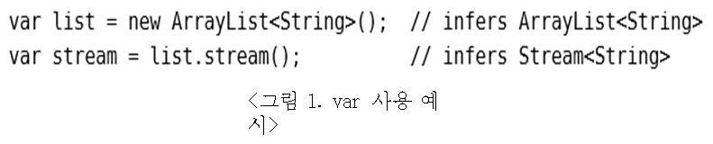

## 프로젝트 설명
 자바 5 문법에서 자바 10에서 추가된 var기능을 구현해보는 프로젝트
 
 
## var 이란?
   
   자바 10에서 새롭게 추가된 예약어
   
   변수명을 통해 타입을 파악할 수 있다는 의견이 모토
   
   지역 변수의 타입을 특정하지 않고도 사용할 수 있게 해줌
   
   키워드가 아니라 예약어 이므로 변수, 메소드, 패키지 이름으로 var 사용해도 문제 없음

## var 사용규칙
   
   선언과 동시에 명확한 타입이 주어져야 함
   
   선언만 불가능
   
   명시적인 타입이 주어져야 함
   
   널 타입 불가능

## 동작 과정
동작 방식

Input – var이 사용된 자바 프로젝트 폴더/파일

Output – var이 명시적인 타입으로 대체된 자바 프로젝트 폴더/파일

1단계

폴더를 뒤져가면서 .java 파일들을 탐색 및 File클래스의 리스트로 보유
.java가 아닌 파일들은 그대로 복사

2단계

File클래스의 리스트로 가지고 있던 .java들을 JavaParser를 이용해 파싱
파싱된 정보를 가지고 var의 명시적인 타입을 찾아 output .java파일 생성

## class 구조

